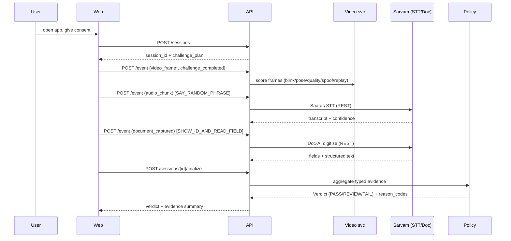
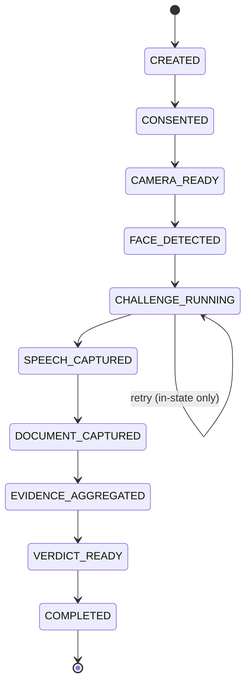

# PRD — Praman: Liveness & Media-Authenticity Verification (MVP)

**Repo:** `bhasaha_census`  ·  **Status:** Locked for build  ·  **Date:** 2026-07-26
**Target:** Working local MVP + live 3-minute demo. Submission lock 4:30 PM.
**Supersedes:** the census/Voice-hero reframe. Aligns with `README.md`, `.specify/memory/constitution.md`, and `docs/liveliness_check_mvp.md`.

---

## 0. One-paragraph summary

**Praman** is a locally-runnable system that answers one question with evidence: *is the media in front of the camera a live, present, real human — or a spoof, replay, or AI-generated fake?* A browser app runs a short **challenge-response** session (blink / turn head / say a random phrase / show a document). Local video intelligence scores **liveness** and **human-vs-AI (deepfake/replay)** risk; **Sarvam** transcribes the spoken phrase and digitizes the shown document; a **deterministic policy engine** fuses all signals into an explainable verdict — `PASS / REVIEW / FAIL / NEEDS_MORE_EVIDENCE` — with reason codes. Anti-fraud, defensive, human-in-the-loop.

**Demo narrative (hold this framing):** *remote verification / onboarding anti-fraud* — proving a real live human (not a deepfake or replayed video) is present. **Not** "verify a citizen's real identity against a government record." Steer the story to *media authenticity*, not identity adjudication.

---

## 1. Non-negotiable guardrails (safety + demo-safety)

These are constraints, not features. Every agent respects them.

1. **Sample / own data only.** Team demos with their own faces and **synthetic or sample** ID documents. No capture of third parties' real government IDs or biometrics.
2. **No real identity backend.** No UIDAI/Aadhaar/government DB, no real KYC/eKYC/watchlist. Fully local and self-contained.
3. **ID numbers masked.** Any extracted ID number is stored/shown as last-4 only (`XXXX XXXX 1234`); full number never logged; PII encrypted at rest (Fernet).
4. **Consent-first.** Explicit consent screen before any camera/mic capture; consent logged to an append-only audit table.
5. **Human-in-the-loop.** The system emits an evidence-backed *recommendation*, not an automated final judgment on a real person. Borderline → manual review.
6. **Positioning:** a defensive anti-fraud / anti-deepfake demo, explicitly **not** a compliance-certified identity product.

---

## 2. Scope

### In scope (MVP)
- Browser webcam + mic capture + document image capture/upload.
- Consent screen.
- Challenge engine (randomized, deterministic under a test seed).
- **Video intelligence:** face presence + tracking, blink (EAR), head-yaw, frame quality, replay/temporal anomaly, human-vs-AI (spoof/deepfake) score.
- **Speech challenge:** say a random phrase → **Sarvam Saaras STT (REST)** → phrase match.
- **Document challenge:** show a sample doc → **Sarvam Doc-AI digitization (REST)** → field extraction + consistency check.
- **Face-match (optional, parking-lot-able):** selfie-frame vs doc photo (InsightFace).
- Deterministic **policy → verdict** with reason codes + evidence summary.
- Local persistence: SQLite metadata + `evidence/` filesystem store + audit log.

### Out of scope (parking lot — do NOT build for MVP)
- Temporal, LangGraph, AWS Bedrock (over-engineered for a 5-hour demo; add post-hackathon).
- Telegram / WhatsApp / any messaging bot (rules flag messaging; harder to demo on a projector).
- Real government/KYC integration, sanctions/PEP, watchlists.
- Sarvam **streaming** STT over WebSocket (use REST; streaming is a latency upgrade, not MVP).
- Training custom deepfake models; passive texture anti-spoof (active challenge only).
- Multi-tenancy, cloud deploy, horizontal scale, KMS.

---

## 3. Stack (scoped + fast)

| Concern | MVP choice | Notes |
|---|---|---|
| Language | Python 3.11+ (typed) | pip + `requirements.txt` |
| Frontend | Plain HTML/JS or lightweight React (Vite) | webcam via `getUserMedia`, `MediaRecorder` |
| Backend | **FastAPI + Uvicorn** (single process) | session, challenge, evidence, verdict |
| Contracts | **Pydantic v2** in `shared/schemas/` | frozen FIRST — the parallel-work seam |
| Video/liveness | **OpenCV + MediaPipe** | blink/pose/quality/replay heuristics |
| Face-match (opt) | **InsightFace** | parking-lot-able |
| Speech | **Sarvam Saaras STT (REST)** behind `SpeechProvider` | phrase match |
| Document | **Sarvam Doc-AI (REST)** behind `DocProvider` | fallback: PaddleOCR local |
| Store | **SQLite** (SQLModel) + `evidence/` FS | + append-only `audit_log` |
| Crypto | `cryptography` (Fernet) | encrypt PII/artifacts at rest |

**Sarvam integrates as two thin REST providers** (below) — easy to add, easy to fake, no major integration risk. `base = https://api.sarvam.ai`, header `api-subscription-key`.

**Dropped from constitution stack for the MVP:** Temporal, LangGraph, Bedrock. (Constitution amendment note: MVP prioritizes a single runnable golden path; these return in a post-hackathon plan.)

---

## 4. High-level architecture (HLD)

```mermaid
flowchart TB
  subgraph Client["apps/web — browser"]
    CAM[webcam + mic] --> UI[session UI + consent + challenge prompts]
    UI --> VERD[verdict + evidence view]
  end
  UI -->|REST: events, frames, audio, doc img| API[apps/api — FastAPI]

  subgraph Backend
    API --> SESS[session + challenge engine]
    API --> VID[services/video — liveness + human-vs-AI]
    API --> SPE[services/speech — SpeechProvider]
    API --> DOC[services/document — DocProvider]
    API --> FACE[services/face — match (optional)]
    SESS --> POL[services/policy — deterministic verdict]
    VID --> POL
    SPE --> POL
    DOC --> POL
    FACE --> POL
    POL --> STORE[(SQLite + evidence/ + audit_log)]
  end

  SPE -.REST.-> SARVAM_S[Sarvam Saaras STT]
  DOC -.REST.-> SARVAM_D[Sarvam Doc-AI]
  POL --> API --> VERD

  classDef sarvam fill:#5b8def,color:#fff;
  class SARVAM_S,SARVAM_D sarvam;
  classDef local fill:#2ea043,color:#fff;
  class VID,FACE local;
```

**Signal fusion (never trust one signal):** presence · active-challenge · speech-match · document-consistency · deepfake/spoof · replay → fused by the policy engine.

### 4.1 Runtime sequence



### 4.2 Session state machine


Transitions are monotonic; retries only inside `CHALLENGE_RUNNING`.

---

## 5. Typed contracts — freeze FIRST (`shared/schemas/`)

This is the integration seam. **Freeze these before splitting work.** All three services import from here; nobody edits another's service, only these shared types (by agreement).

```python
# shared/schemas/core.py
from enum import Enum
from typing import Literal, Optional
from pydantic import BaseModel, Field

class ChallengeType(str, Enum):
    LOOK_LEFT_RIGHT = "LOOK_LEFT_RIGHT"
    BLINK_TWICE = "BLINK_TWICE"
    SAY_RANDOM_PHRASE = "SAY_RANDOM_PHRASE"
    SHOW_ID_AND_READ_FIELD = "SHOW_ID_AND_READ_FIELD"

class Challenge(BaseModel):
    challenge_id: str
    type: ChallengeType
    prompt_text: str
    expected_response: Optional[str] = None   # e.g. the random phrase
    time_limit_ms: int = 15000
    min_confidence: float = 0.6
    max_attempts: int = 3

class SessionState(str, Enum):
    CREATED="CREATED"; CONSENTED="CONSENTED"; CAMERA_READY="CAMERA_READY"
    FACE_DETECTED="FACE_DETECTED"; CHALLENGE_RUNNING="CHALLENGE_RUNNING"
    SPEECH_CAPTURED="SPEECH_CAPTURED"; DOCUMENT_CAPTURED="DOCUMENT_CAPTURED"
    EVIDENCE_AGGREGATED="EVIDENCE_AGGREGATED"; VERDICT_READY="VERDICT_READY"
    COMPLETED="COMPLETED"

class Session(BaseModel):
    session_id: str
    state: SessionState = SessionState.CREATED
    locale: str = "en-IN"
    challenge_plan: list[Challenge] = Field(default_factory=list)

# ---- per-branch typed scores (each service OWNS one) ----
class VideoScores(BaseModel):
    face_present: bool = False
    track_stable: bool = False
    quality_score: float = 0.0
    motion_score: float = 0.0
    spoof_score: float = 0.0        # human-vs-AI: higher = more likely fake
    replay_score: float = 0.0
    challenge_passed: bool = False

class SpeechScores(BaseModel):
    transcript: str = ""
    confidence: float = 0.0
    latency_ms: int = 0
    phrase_match_score: float = 0.0

class DocScores(BaseModel):
    document_text: str = ""
    detected_fields: dict[str, str] = Field(default_factory=dict)  # id masked
    document_quality_score: float = 0.0
    document_match_score: float = 0.0

class FaceScores(BaseModel):
    face_sim: float = 0.0           # cosine [0,1]; optional branch

class Evidence(BaseModel):
    session_id: str
    video: Optional[VideoScores] = None
    speech: Optional[SpeechScores] = None
    document: Optional[DocScores] = None
    face: Optional[FaceScores] = None

# ---- verdict (policy engine OWNS) ----
Verdict = Literal["PASS", "REVIEW", "FAIL", "NEEDS_MORE_EVIDENCE"]

class VerdictResult(BaseModel):
    session_id: str
    verdict: Verdict
    confidence: float
    reason_codes: list[str]
    evidence: Evidence
    next_action: Literal["allow", "manual_review", "retry"]
```

### Provider interfaces (the swap points — real ⇄ fake ⇄ Sarvam)

```python
# shared/schemas/providers.py
from typing import Protocol
class SpeechProvider(Protocol):
    def transcribe(self, audio_wav: bytes, lang: str) -> "SpeechScores": ...
class DocProvider(Protocol):
    def digitize(self, image: bytes, lang: str) -> "DocScores": ...
```
- `FakeSpeechProvider` / `FakeDocProvider`: deterministic canned scores (for parallel dev + offline demo fallback).
- `SarvamSpeechProvider`: `POST https://api.sarvam.ai/speech-to-text` (Saaras v3, REST).
- `SarvamDocProvider`: `POST https://api.sarvam.ai/doc-digitization/job/v1` (poll `job_id`).
- `env SARVAM_KEY` selects real vs fake via one config flag. **No code change to swap.**

---

## 6. REST API contract (`apps/api`)

| Method | Path | Purpose |
|---|---|---|
| `POST` | `/sessions` | create session + challenge plan (`{locale}` → `{session_id, challenge_plan}`) |
| `POST` | `/sessions/{id}/consent` | log consent (required before capture) |
| `POST` | `/sessions/{id}/event` | ingest `video_frame` \| `audio_chunk` \| `challenge_completed` \| `document_captured` |
| `GET`  | `/sessions/{id}` | session state + evidence summary |
| `POST` | `/sessions/{id}/finalize` | run policy → return `VerdictResult` |

All bodies/responses are the Pydantic models above. `dict` payloads forbidden at boundaries (constitution III).

---

## 7. Three-agent parallel plan

Freeze `shared/schemas/` together (30 min). Then each person's agent works in its own directory against **fake providers** — zero cross-blocking. Integration is proven at **M1**, not the end.

| # | Owner | Directory | Deliverable | Golden acceptance test | Depends on |
|---|---|---|---|---|---|
| **A** | **You** — Frontend + UX | `apps/web/` | Webcam/mic/doc capture, consent screen, live challenge prompts, verdict view; talks REST | With API in fake mode: complete a full session in the browser → see a `PASS` verdict card | schemas only |
| **B** | **Pratik** — Video/media intelligence | `services/video/` (+ `services/face/`) | MediaPipe liveness (blink EAR, yaw, quality) + replay/temporal + human-vs-AI spoof score → `VideoScores`; optional InsightFace `FaceScores` | Feed a real webcam clip → correct `challenge_passed`, plausible `spoof_score`; feed a replay/video-of-video → `replay_score`/`spoof_score` rises | schemas only |
| **C** | **3rd** — Backend + Sarvam + policy | `apps/api/`, `services/speech/`, `services/document/`, `services/policy/`, `storage/` | FastAPI session/challenge engine, `SarvamSpeechProvider` + `SarvamDocProvider` (REST) + fakes, deterministic verdict, SQLite+evidence+audit | Post a scripted event stream (fixtures) → deterministic `VerdictResult`; unit tests cover every threshold band | schemas only |

**Rule:** any change to `shared/schemas/` is announced in the team channel before editing (it's everyone's contract). Everyone can run the whole app locally via fakes at any time.

---

## 8. Deterministic policy (owned by C)

Weights (starting point, env-tunable): video liveness 30% · active challenge 30% · speech match 20% · document consistency 20%.

```
hard-fail  → FAIL:   no face after grace | challenge timeout | mandatory phrase mismatch
                     | document unreadable | spoof_score > CRIT
PASS   if  score >= 0.80 and no hard-fail and (>=1 active + speech + doc challenge passed)
REVIEW if  0.55 <= score < 0.80  (or mixed/low-confidence)
FAIL   if  score < 0.55 or any hard-fail
NEEDS_MORE_EVIDENCE if a required branch produced no signal
```
LLM is **not** in the decision path (constitution V). Every verdict writes an audit row: scores, thresholds, decision, timestamp, session_id.

---

## 9. Milestone timeline (compressed to lock at 4:30)

| M | Focus | Runnable artifact | Acceptance test | If behind, cut to |
|---|---|---|---|---|
| **M0** (~30m) | Freeze `shared/schemas/`, repo skeleton, `requirements.txt`, fakes | All 3 services import shared types; app boots in fake mode | `pytest` on schema round-trip green | — |
| **M1** (~60m) | **Walking skeleton on ONE machine, fakes wired end-to-end** | Browser → API → fake video/speech/doc → verdict card | Complete a session in the browser, get `PASS` from fakes | this IS the fallback demo |
| **M2** (~60m) | Real video: MediaPipe blink+yaw+quality challenge (B); real challenge engine (C); capture UI (A) | Live blink challenge actually passes/fails | Blink on cue → pass; stay still → fail | keep 1 challenge type (blink) only |
| **M3** (~60m) | **Sarvam in:** Saaras STT phrase match + Doc-AI OCR (masked) behind providers | Say phrase → transcript match; show sample doc → fields | Real Sarvam REST returns transcript + doc fields; masking verified | fall back to Fake providers (offline) |
| **M4** (~45m) | Human-vs-AI spoof/replay score + policy fusion + verdict reasons; face-match optional | Real fused `VerdictResult` with reason codes | Replay clip → `REVIEW/FAIL`; live human → `PASS`, ≥3 repeats | drop face-match; keep liveness+doc |
| **M5** (~45m) | Integrate real providers, repeat 3 cases, test from a 2nd device, record fallback video | Public/LAN URL works on a phone; 3 clean runs | 3/3 correct verdicts, no operator help | demo on localhost if LAN flaky |
| **M6** (~30m) | Freeze. Reset state, fallback recording, 2 timed rehearsals. **No new features.** | Demo-ready build + recording | 2 rehearsals under 3:00 | — |

**Hardest dependency, de-risked first:** getting MediaPipe/InsightFace/Sarvam producing real scores on one machine. M1 ships with **mocked-score fallback** so a model download or network blip can never sink the demo.

---

## 10. Demo script (3:00)

- **0:00–0:30 — Context.** "Remote verification is being attacked by deepfakes and replayed video. Praman proves a *live, real human* is present — locally, with explainable evidence."
- **0:30–0:50 — The problem.** Show a replayed video / static photo held to the camera → Praman flags it (`spoof/replay` rises) → `FAIL/REVIEW`. *(The anti-fraud hook.)*
- **0:50–2:30 — Live golden path.** A teammate does the session live: consent → blink-on-cue (liveness passes) → say the random phrase (Sarvam STT matches) → show a sample ID (Sarvam Doc-AI extracts, number masked) → **`PASS`** with reason codes + evidence panel. Repeat once with a second person to show consistency.
- **2:30–3:00 — Impact + close.** Local-first, consent-first, human-in-the-loop, swappable providers. "Every verdict is evidence-backed and replayable."

### Evidence map (each demo moment → one point)
| Demo moment | Proves |
|---|---|
| Replay/photo rejected | Human-vs-AI / anti-spoof (the hero) |
| Blink-on-cue passes | Liveness / active challenge |
| Phrase transcribed & matched | Sarvam speech integration |
| Sample doc fields + masking | Sarvam Doc-AI + privacy guardrail |
| Verdict card + reason codes | Deterministic, explainable decisioning |
| 2 people, consistent results | Reliability / repeatability |

### Likely judge question + answer
- **Q:** "Isn't this a privacy/identity risk?"
  **A:** "It never touches a real identity database — it's fully local, consent-first, IDs masked to last-4 and encrypted, and it emits a human-reviewed recommendation, not an automated identity judgment. It's a *media-authenticity* tool, not a KYC product."

---

## 11. Parking lot (only if explicitly rescoped)
Temporal · LangGraph · Bedrock orchestration · Telegram/WhatsApp bot · Sarvam streaming WebSocket STT · passive anti-spoof · face-match (if it fights us) · real KYC/government integration · cloud deploy · multi-tenant.

---

## 12. Definition of done (MVP)
- [ ] Session created + consent logged locally.
- [ ] User completes ≥3 challenge types (physical, speech, document).
- [ ] Sarvam STT returns usable transcript for the spoken phrase (REST).
- [ ] Sarvam Doc-AI extracts fields from a sample document; ID masked.
- [ ] Human-vs-AI / replay produces a real spoof score; replayed media is flagged.
- [ ] Deterministic `PASS/REVIEW/FAIL` + reason codes + evidence persisted.
- [ ] 3 consecutive correct runs, no operator intervention.
- [ ] Fallback recording captured; 2 rehearsals under 3:00.
